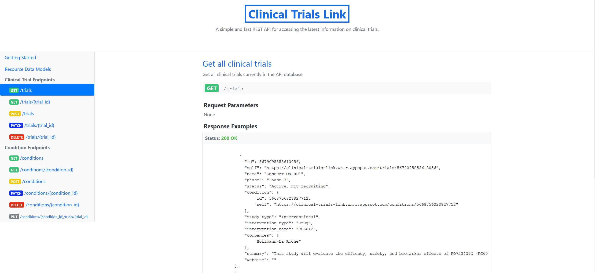
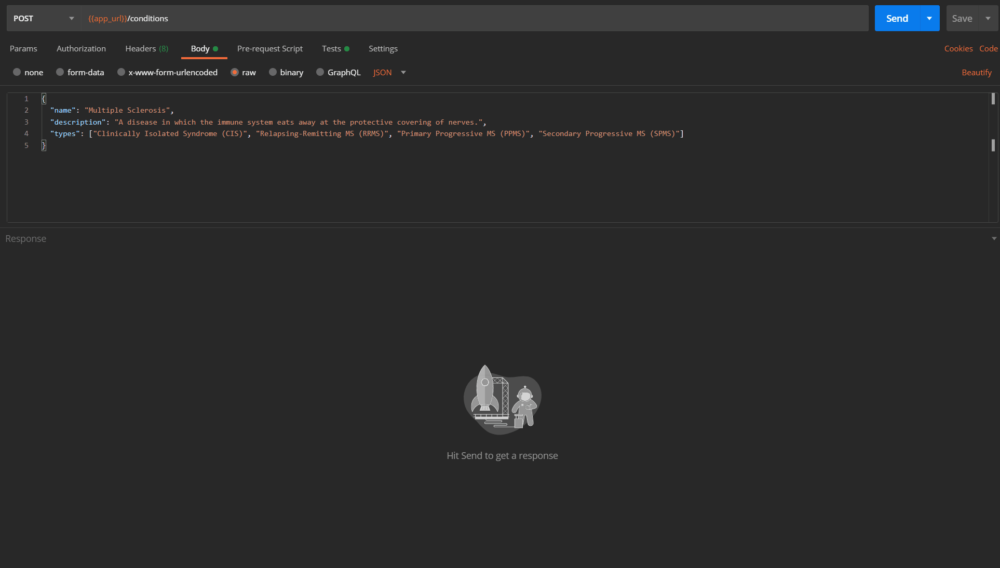

# Clinical Trials Link

Clinical Trials Link is a REST API that allows users to store, access, and use clinical trial data in a meaningful way.

Some of its features include:

* Fully RESTful
* The ability to create, edit, view, and delete resources
* Authentication and authorization
* Complete documentation

## Documentation

The documentation for this API can be found [here](https://clinical-trials-link.wn.r.appspot.com/documentation). Note that creating an account is necessary if you'd like to make requests to this API.

## Request Example

## Author

* [Anjanette Oborn](https://github.com/oborna)

## License

All rights reserved.